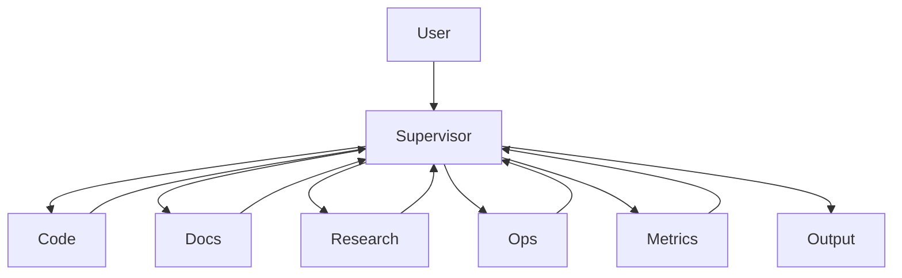

# ZeroClaw AGENTS (Optimized)

## Mission
Multi-agent orchestration for secure, sandboxed workflows: code, docs, ops, research.

## TOC
- [Architecture](#architecture)
- [Agents](#agents)
- [Workflows](#workflows)
- [Configs](#configs)
- [Docker/Tailscale](#dockertailscale)
- [LLM/Metrics](#llmmetrics)
- [Troubleshoot](#troubleshoot)

## Architecture


## Agents
| Agent | Role/Config/Tools |
|-------|-------------------|
| **Supervisor** | Task routing. Prompt: Analyze/delegate/verify. `autonomy:supervised, temp:0.3, model:deepseek`. Tools: router, memory. |
| **Code** | Code/git. Prompt: Clean code in workspace. `model:codellama, cmds:python,node,gcc`. Tools: exec, edit, git. |
| **Docs** | MD/PDF. Prompt: Pro docs. `max_results:10`. Tools: pandoc, write. |
| **Research** | Search/summarize. Prompt: Cite 3-5 bullets. `web_search:ddg, max:5`. Tools: search. |
| **Ops** | Admin/logs. Prompt: Safe workspace tasks. `cmds:df,ps,docker`. Tools: shell(limited). |
| **Metrics** | Logs/perf. Prompt: Analyze audit.log/docker stats. `cmds:docker stats`. Tools: grep, alert. |

## Workflows
**Docs Update:**
1. Supervisor → Research (Ollama info)
2. → Code (edit MD)
3. → Metrics (audit)
4. Commit.

**Code Proj:**
1. → Code (write)
2. → Ops (docker up)
3. → Docs (README)
4. Metrics validate.

**Deploy:**
1. → Ops (pull/restart)
2. → Docs (notes)
3. Metrics health.

## Configs {#configs}
```toml
[autonomy] level="supervised" max_actions_per_hour=200
[storage] backend="sqlite"
[memory] embedding="local"
[web_search] enabled=true max_results=10
[prometheus] enabled=true port=9090
```

## Security
- Whitelist cmds/paths.
- Costs: $5/day.
- Audit: /logs/audit.log.
- Sandbox: /workspace only.
- Tailscale VPN:42617.

## Docker/Tailscale {#dockertailscale}
```
docker compose up -d
docker logs zeroclaw
```
Volumes: /zeroclaw-data/{workspace,logs}. Access: `tsnet://ip:42617 --pair`.

## LLM/Metrics {#llmmetrics}
Ollama:
```
docker run -d -p11434:11434 ollama/ollama
ollama pull llama3.1:8b codellama:7b
```
config: `[models.ollama] url="http://host.docker.internal:11434"`.

Metrics Agent: token/action latency, docker stats, Grafana.

## Troubleshoot {#troubleshoot}
- Stuck: `memory prune`; check costs/actions.
- Perms: docker logs; whitelist.
- Tailscale: `status`; ping.
- Ollama: `docker ps`.
- Logs: prune volumes.
- Costs: max_results=3.

**v1.2 Optimized (~70% shorter)**
