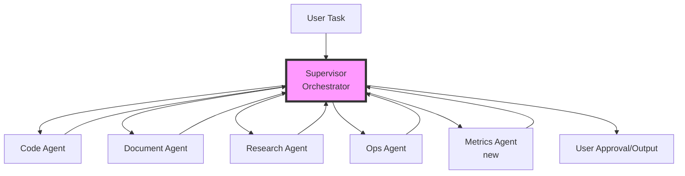

# ZeroClaw AGENTS Configuration

## Mission
Multi-agent orchestration for complex autonomous workflows in secure, sandboxed environment. Agents collaborate on tasks like code generation, document processing, system administration, and creative problem-solving.

## Table of Contents
- [Core Principles](#core-principles)
- [Recommended Agent Architecture](#recommended-agent-architecture)
  - [Supervisor Agent](#supervisor-agent-orchestrator)
  - [Code Agent](#code-agent)
  - [Document Agent](#document-agent)
  - [Research Agent](#research-agent)
  - [Ops Agent](#ops-agent)
- [Multi-Agent Workflow Examples](#multi-agent-workflow-examples)
- [Optimal Configuration Updates](#optimal-configuration-updates-configtoml)
- [Security Hardening](#security-hardening)
- [Docker & Tailscale Integration](#docker--tailscale-integration)
- [Deployment Best Practices](#deployment-best-practices)
- [Local LLM Setup](#local-llm-setup)
- [Metrics & Monitoring](#metrics--monitoring)
- [Troubleshooting](#troubleshooting)

## Core Principles
- **Modularity**: Specialized agents for specific domains (code, docs, ops, research).
- **Collaboration**: Supervisor agent routes tasks, coordinates handoffs.
- **Safety**: Permission gates, cost limits, audit trails.
- **Efficiency**: Memory sharing, tool reuse, parallel execution.
- **Privacy**: Local execution, no external data leakage.
- **Containerization**: Docker sandbox (/zeroclaw-data/workspace), Tailscale VPN access (port 42617).

## Recommended Agent Architecture



### 1. Supervisor Agent (Orchestrator)

| Aspect | Configuration |
|--------|---------------|
| **Role** | Task decomposition, routing, progress tracking |
| **Prompt** | "You are ZeroClaw Supervisor. Analyze tasks, break into subtasks, delegate to specialist agents. Verify outputs. Escalate to user if uncertain. Use Docker workspace /zeroclaw-data/workspace." |
| **Config** | autonomy: supervised<br>temperature: 0.3 (precise)<br>max_actions: 5/cycle<br>model: deepseek-chat or ollama/llama3.1 |
| **Tools** | task_router, memory_recall |

**Triggers**: All incoming tasks.

### 2. Code Agent

| Aspect | Configuration |
|--------|---------------|
| **Role** | Code writing, debugging, git ops |
| **Prompt** | "Senior Software Engineer. Write clean, tested code in /zeroclaw-data/workspace. Use allowed_commands. Commit semantically." |
| **Config** | model: deepseek-chat or ollama/codellama<br>allowed_commands += python,node,gcc,make<br>workspace_only: true |
| **Tools** | code_execution, file_edit, git |

**Specializes**: scripts/, src/, build automation.

### 3. Document Agent

| Aspect | Configuration |
|--------|---------------|
| **Role** | Document generation, markdown, reports |
| **Prompt** | "Technical Writer. Transform data to pro docs in /zeroclaw-data/workspace. Export MD+PDF." |
| **Config** | max_results: 10<br>model: deepseek-chat or ollama/llama3 |
| **Tools** | pandoc, file_write |

**Specializes**: workspace/*.md, PDFs.

### 4. Research Agent

| Aspect | Configuration |
|--------|---------------|
| **Role** | Web search, fact-finding, summarization |
| **Prompt** | "Research Analyst. Use web_search, cite sources, 3-5 bullets." |
| **Config** | web_search.enabled=true<br>provider: duckduckgo or brave<br>max_results: 5 |
| **Tools** | web_search, summarize |

**Specializes**: Market analysis, tech updates.

### 5. Ops Agent

| Aspect | Configuration |
|--------|---------------|
| **Role** | System admin, monitoring, cleanup |
| **Prompt** | "DevOps Engineer. Safe tasks in Docker workspace. Report before execute." |
| **Config** | allowed_commands += df,top,ps,docker logs<br>forbidden_paths: /etc,/root,...<br>workspace_only: true |
| **Tools** | shell_exec (limited), logs |

**Triggers**: Infra tasks.

### 6. Metrics Agent

| Aspect | Configuration |
|--------|---------------|
| **Role** | Monitoring, logs analysis, performance reporting |
| **Prompt** | "Metrics Analyst. Analyze audit.log, docker logs zeroclaw, resource usage. Alert on anomalies. Generate reports." |
| **Config** | allowed_commands += df,top,docker stats<br>model: deepseek-chat or ollama/llama3 |
| **Tools** | log_grep, prometheus_query, alert |

**Specializes**: System health, cost tracking, audit reviews.
**Triggers**: Scheduled (cron), on errors.

## Multi-Agent Workflow Examples

### Document Pipeline
```
User: "Update AGENTS.md with Ollama"
1. Supervisor → Document Agent: Parse current MD
2. → Research Agent: Ollama best practices
3. → Code Agent: Update tables/code blocks
4. → Metrics Agent: Audit changes
5. Supervisor: Review → `git commit` in workspace
```

### Code Project
```
User: "Add monitoring script"
1. Supervisor → Code Agent: Write Prometheus exporter
2. → Ops Agent: `docker compose up`
3. → Document Agent: Update README.md
4. → Metrics Agent: Validate metrics
```

### Docker Deploy Pipeline {#docker-deploy}
```
User: "Deploy new agent config"
1. Supervisor → Ops Agent: `docker compose pull`
2. → Code Agent: Update config.toml in workspace
3. → Document Agent: Generate deploy notes
4. Metrics Agent: Health check `docker logs zeroclaw`
5. Supervisor: `docker compose restart` → Confirm via Tailscale
```

## Optimal Configuration Updates (config.toml)

```toml
[autonomy]
level = "supervised"  # Safe default
max_actions_per_hour = 200

[storage]
backend = "sqlite"  # Agent memory sharing

[memory]
embedding_provider = "local"  # RAG for agent handoffs

[web_search]
enabled = true
max_results = 10
```

## Security Hardening
- **Command Whitelist**: Extend allowed_commands carefully (see Ops/Metrics agents).
- **Cost Guardrails**: $5/day initial limit (max_cost_per_day_cents=500).
- **Audit Everything**: security.audit.enabled = true (/zeroclaw-data/logs/audit.log).
- **Sandbox**: workspace_only = true (/zeroclaw-data/workspace).
- **Pairing**: require_pairing = true.
- **Tailscale**: VPN-only access (tailscale:healthy).

## Docker & Tailscale Integration {#docker--tailscale-integration}

This setup uses Docker Compose with Tailscale sidecar:

```
docker compose up -d  # Starts zeroclaw on Tailscale IP:42617
docker logs zeroclaw  # Check health
```

**Key Volumes:**
- `/zeroclaw-data/workspace`: Agent files (AGENTS.md copied here).
- `/zeroclaw-data/logs`: Audit logs.

**Access:** `zeroclaw --url tsnet://tailscale-ip:42617 --pair`

**Agents in Docker:**
- Supervisor reads from workspace.
- Ops: `docker logs`, `df -h /zeroclaw-data`.

## Local LLM Setup {#local-llm-setup}

Run Ollama alongside for privacy/offline:

```
docker run -d -v ollama:/root/.ollama -p 11434:11434 ollama/ollama
ollama pull llama3.1:8b  # Supervisor/Code
ollama pull codellama:7b  # Code Agent
```

config.toml:
```toml
[models.ollama]
url = "http://host.docker.internal:11434"
default_model = "llama3.1"
```

**Benefits:** No API costs, faster local inference.

## Metrics & Monitoring {#metrics--monitoring}

**Enable Prometheus:**
```toml
[prometheus]
enabled = true
port = 9090
```

**Metrics Agent Queries:**
- Token usage, action latency.
- `docker stats zeroclaw`, log volume.

**Grafana Dashboards:** Import Zeroclaw preset for CPU/GPU/cost viz.

## Deployment Best Practices
1. Start supervised, graduate to full autonomy.
2. Monitor audit.log for agent behavior.
3. Backup /zeroclaw-data/workspace regularly.
4. Scale: Add agents via custom prompts.

## Troubleshooting {#troubleshooting}
- **Agent stuck**: `zeroclaw memory prune`; check max_actions/costs in config.toml.
- **Permission denied**: Verify allowed_commands; `docker logs zeroclaw`.
- **Docker issues**: `docker compose logs tailscale`; ensure tsnet healthy.
- **Tailscale access**: `tailscale status`; ping from Tailscale network.
- **Ollama not found**: `docker ps | grep ollama`; check host.docker.internal.
- **High costs**: Metrics Agent report; lower max_results=3.
- **Logs full**: `docker volume prune zeroclaw-data/logs`; rotate audit.log.

**Version: 1.1** | **Status: Production Ready - Docker/Tailscale Optimized**
